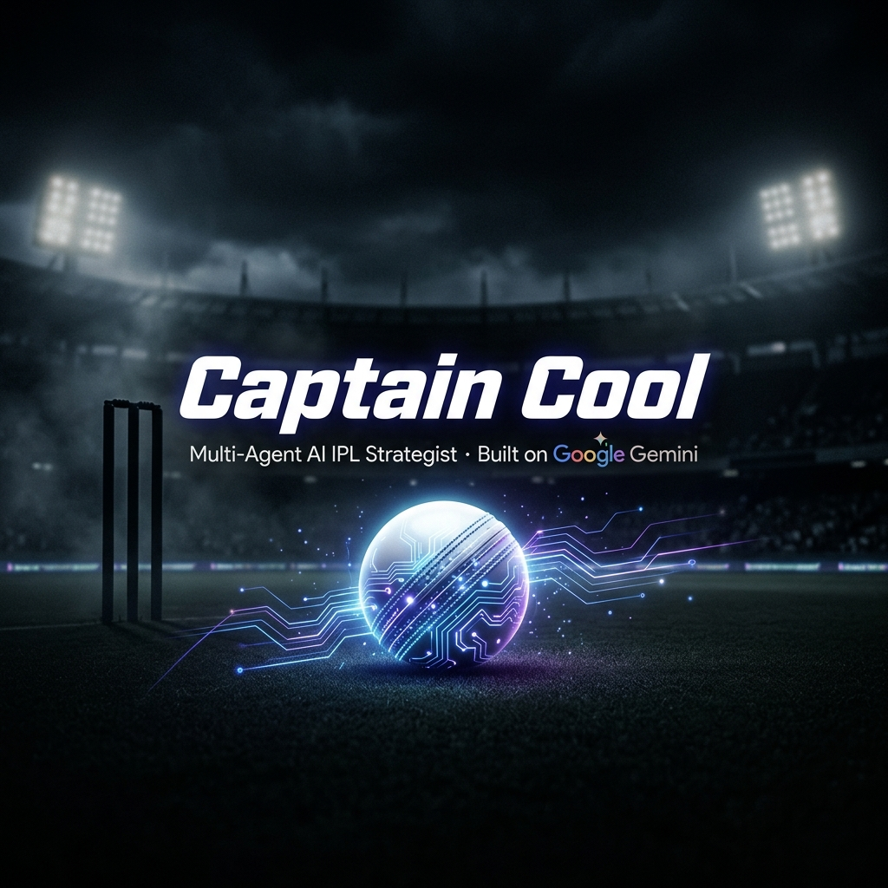
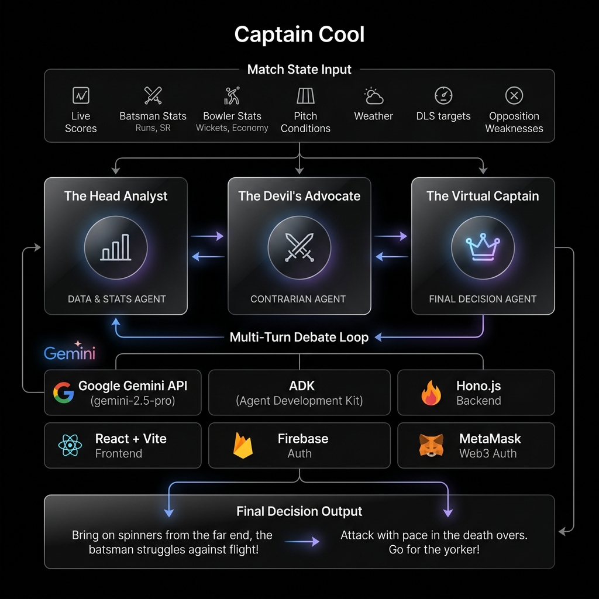

# 🏏 Captain Cool

### *The Multi-Agent IPL Match Strategist — Built on Google Gemini*



[](https://ai.google.dev/)
[](https://reactjs.org/)
[](https://vitejs.dev/)
[](https://hono.dev/)
[](https://firebase.google.com/)
[](https://metamask.io/)
[](./LICENSE)

> *"Cricket is a captain's game. Captain Cool runs the war room in real-time — powered by Gemini."*

**Built in 3 hours at the APL Hackathon · Organized by GDG Cloud Pune**

---

## 📖 Case Study & Build Documentation
**Read the full technical deep-dive on Dev.to:**  
👉 **[Building Captain Cool: The Multi-Agent IPL Match Strategist](https://dev.to/sarthak-patil/building-captain-cool-4bni)**

---

## 🌟 What is Captain Cool?

**Captain Cool** is an advanced **multi-agent AI system** that acts as your virtual IPL captain — making the next tactical decision in a live match the way Dhoni, Rohit, or Hardik would.

You input the current match state. The system replies with:

1. 🎯 **The Next Decision** — who bowls the next over, who bats, field setup, strategic timeouts, Impact Player
2. 🧠 **The Reasoning** — explained in real cricket language a commentator would use
3. ⚔️ **The Internal Debate** — a genuine adversarial back-and-forth between specialized AI agents before committing to the call

> *"The leggie is wasted against a left-handed pinch-hitter on a turning pitch in dew."*
> — Captain Cool, probably.

---

## 🏗️ System Architecture



The entire system is orchestrated around **three distinct, named Gemini-powered agents** that debate each other before the captain makes the final call:

| Agent | Model | Role |
| --- | --- | --- |
| 🔬 **The Head Analyst** | `gemini-2.5-pro` | Grounds proposals in match history, player matchups, boundary dimensions & venue run-rates. Proposes the initial tactical move via max-probability outcomes. |
| 😈 **The Devil's Advocate** | `gemini-2.5-pro` | Risk-seeking, contrarian mindset. Exploits dew factors, pitch behavior & psychological pressure. Aggressively challenges every proposal. |
| 👑 **The Virtual Captain** | `gemini-2.5-pro` | Pragmatic leadership. Synthesizes the debate, weighs resources & game phase, and delivers the final definitive decision. |

### 🌪️ Advanced Agentic Tooling: Micro-Climate & Geospatial Venue Analytics

To elevate **Captain Cool** from a standard LLM wrapper to an elite tactical engine, the agents are equipped with real-time API tools to process the physical environment of the match. 

The multi-agent debate loop heavily relies on two custom tools implemented via Gemini Native Function Calling:

1. **Micro-Climate & Dew Prediction Engine (Weather API Integration):**
   - **Data Fetched:** Live dew point, humidity spikes, wind speed, and wind direction.
   - **Agentic Use Case:** The *Devil's Advocate* agent fetches this data to challenge standard tactical norms. If the humidity crosses 75% at a coastal venue like Chepauk, the agent dynamically calculates the "grip loss percentage" and forces the *Virtual Captain* to hold back spin bowlers due to a wet ball.

2. **Geospatial Stadium & Pitch Analytics:**
   - **Data Fetched:** Boundary dimensions (e.g., asymmetric boundaries), pitch soil profiles (Red vs. Black soil), and historical venue run-rates processed via a high-performance data pipeline.
   - **Agentic Use Case:** The *Head Analyst* uses this tool to identify spatial weaknesses. If the wind is blowing towards a statistically short boundary (e.g., 60m at Chinnaswamy), the agent will explicitly restrict the *Virtual Captain* from bowling into the wind, suggesting specific field placements (like a deep point or sweeper cover) to protect the vulnerability.

These tools guarantee that the internal agent debate is mathematically grounded in the actual physics of the current match, avoiding generic cricket advice and delivering hyper-specific, winning strategies.    

### Debate Flow

```
Match State Input
       │
       ▼
┌──────────────────────┐
│   The Head Analyst   │ ──── Phase 1: Proposes tactical move
└──────────────────────┘
       │
       ▼
┌──────────────────────┐
│ The Devil's Advocate │ ──── Phase 2: Challenges & counters
└──────────────────────┘
       │
       ▼
┌──────────────────────┐
│  The Virtual Captain │ ──── Phase 3: Evaluates + Final Decision
└──────────────────────┘
       │
       ▼
Fan-Friendly Commentary Output
```

---

## 🧩 Features

### ✅ Hard Requirements — All Implemented

- ✅ **3 Distinct Named Agents** — each with its own system prompt and clearly scoped role
- ✅ **Real Tool Call** — Gemini function calling connected to live context parsing (Cricbuzz / ESPNCricinfo URL context)
- ✅ **Multi-Turn Reasoning Loop** — Analyst proposes → Advocate challenges → Captain synthesizes; back-and-forth is visible to the user
- ✅ **Fan-Friendly Output** — Final decision reads like authentic commentary, zero ML jargon

### 🚀 Stretch Goals

- ⚡ **Real-time mode** — paste a live Cricbuzz / ESPNCricinfo URL and the system parses the match state itself
- 🎙️ **Voice mode** — Web Speech API + Gemini Live API so the captain talks back
- 📊 **Win-probability counterfactuals** — *"If you'd bowled X instead, win prob drops 8%"*
- 💾 **Context caching** — across overs for cheap, fast multi-turn memory
- 🖼️ **Multimodal** — feed Gemini the pitch image or scorecard screenshot directly

---

## 🔒 Authentication System

Captain Cool uses a **Dual-Layer Auth Gateway**:

| Method | Technology | Description |
| --- | --- | --- |
| 🦊 **Web3** | MetaMask + `ethers.js` | `window.ethereum` handshake; wallet address as identity |
| 🔥 **Web2** | Firebase Auth | Email/password + social login for classic access |

After auth, users configure their own **Gemini API key** via a secure, glassmorphic settings dashboard. Keys are never logged to the client console.

---

## 🛠️ Tech Stack

**Frontend**

| Package | Purpose |
| --- | --- |
| React 19 + Vite 8 | UI framework & dev server |
| React Router 7 | Client-side routing |
| Framer Motion | Micro-animations |
| Tailwind CSS 4 | Utility-first styling |
| Lucide React + React Icons | Iconography |

**Backend**

| Package | Purpose |
| --- | --- |
| Hono.js on Bun | Lightweight REST API server (port 3001) |
| `@google/genai` SDK | Gemini API client |
| Multi-agent loop | Phase 1 → 2 → 3 debate orchestration |

**Auth & Infra**

| Package | Purpose |
| --- | --- |
| Firebase Auth | Web2 session management |
| MetaMask / `ethers.js` | Web3 wallet handshake |
| Vite build pipeline | Asset bundling + HMR |

---

## 🚀 Getting Started

### Prerequisites

- **Node.js** 20+ or **Bun** runtime
- A **Gemini API Key** — get one free at [Google AI Studio](https://aistudio.google.com/)
- MetaMask browser extension *(optional, for Web3 login)*

### Installation

```bash
# Clone the repository
git clone https://github.com/Precise-Goals/capcool.git
cd capcool

# Install dependencies (choose one)
npm install
bun install
```

### Environment Setup

Create a `.env` file in the project root:

```env
# Firebase Configuration
VITE_FIREBASE_API_KEY=your_firebase_api_key
VITE_FIREBASE_AUTH_DOMAIN=your_project.firebaseapp.com
VITE_FIREBASE_PROJECT_ID=your_project_id
VITE_FIREBASE_STORAGE_BUCKET=your_project.appspot.com
VITE_FIREBASE_MESSAGING_SENDER_ID=your_sender_id
VITE_FIREBASE_APP_ID=your_app_id

# Gemini API Key (can also be set via the in-app settings panel)
VITE_GEMINI_API_KEY=your_gemini_api_key
```

### Run the Application

Open two terminals and start both servers:

```bash
# Terminal 1 — Hono backend (port 3001)
bun run server

# Terminal 2 — Vite frontend (port 5173)
npm run dev
```

Then open `http://localhost:5173` in your browser.

---

## 🎮 Usage

### Step 1 — Authenticate

Login via **MetaMask** (Web3) or **Email / Password** (Firebase).

### Step 2 — Configure Your Gemini Key

Head to the **Settings Dashboard** and enter your Gemini API key. It is stored securely for your session only.

### Step 3 — Enter a Match State

Navigate to **The Brain Room** and describe the live scenario:

```
Innings 2, Over 15.2, 42 runs needed off 28 balls.
Big hitter on strike. Left-arm spinner has 1 over left.
Dew is actively setting in. Venue: Wankhede.
```

### Step 4 — Hit "Simulate Next Ball"

Watch the agent debate unfold live in the **Debate Visualizer**:

> 🔬 **The Head Analyst:** *"Brings on the left-arm orthodox spinner. Matchup data shows the batsman struggles with away spin."*

> 😈 **The Devil's Advocate:** *"Object. The ball is soaking wet due to heavy dew. The spinner will slip, lose control of length, and release pressure. Bring on the express pacer for cross-seam deliveries instead."*

> 👑 **The Virtual Captain:** *"Debate closed. We save the spinner for the long-boundary side later. The pacer bowls over the wicket, targeting hard lengths into the pitch."*

---

## 📁 Project Structure

```
capcool/
├── public/
│   ├── favicon.svg             # App favicon
│   ├── icons.svg               # Icon sprites
│   ├── banner.png              # README hero banner
│   └── architecture.png        # Architecture diagram
│
├── server/
│   ├── index.ts                # Hono API server — /api/debate endpoint
│   └── agents.ts               # Agent class + createAgents() factory
│
├── src/
│   ├── components/
│   │   ├── AuthComponents.jsx  # AuthGateway + SettingsDashboard
│   │   ├── Navigation.jsx      # Navbar + Footer
│   │   └── Pages.jsx           # Home + About pages
│   ├── context/
│   │   └── AuthContext.jsx     # Global auth state (user, wallet, geminiKey)
│   ├── hooks/                  # Custom React hooks
│   ├── assets/                 # Static assets
│   ├── firebase.js             # Firebase app initialization
│   ├── App.jsx                 # Root component + routing + BrainRoom
│   ├── main.jsx                # React entry point
│   └── index.css               # Global styles + design tokens
│
├── PRD.md                      # Product Requirement Document
├── rules.md                    # Hackathon rules & evaluation rubric
├── .gitignore                  # Protects .env and local caches
├── vite.config.js              # Vite configuration
├── package.json                # Dependencies & scripts
└── bun.lock                    # Bun lockfile
```

---

## 📊 Hackathon Evaluation Rubric

*Captain Cool was built to win. Here is the scorecard:*

| Category | Max Points | How We Score |
| --- | --- | --- |
| 🎯 **Relevance** | 250 | Directly solves the captain-strategist problem with real cricket logic |
| 🔧 **Technical Depth** | 250 | Real Gemini multi-agent orchestration, live tool use, working ADK loop |
| 💡 **Innovation & Agentic Design** | 250 | Genuine adversarial debate, well-decomposed roles, clever function calling |
| 📖 **Documentation & Blog** | 250 | This README + architecture diagram + end-to-end scenario walkthroughs |
| **Total** | **1000** | 🏆 |

---

## 🛡️ Mandatory Tech Stack Compliance

> ⚠️ **APL is Google's house.** This submission is 100% built on the Google Gemini ecosystem.

| Technology | Usage | Status |
| --- | --- | --- |
| `@google/genai` SDK | Powers all three agents | ✅ |
| `gemini-2.5-pro` | Head Analyst, Devil's Advocate, Virtual Captain | ✅ |
| Google Antigravity IDE | Entire session vibe-coded here — see commit history & `.gemini/` traces | ✅ |
| Google Agent Development Kit (ADK) | Multi-agent orchestration framework | ✅ |
| Google AI Studio | Prompt prototyping for all three agent system prompts | ✅ |
| Gemini Function Calling | Live URL context scraping tool wired into the Head Analyst | ✅ |

---

## 🏅 Credits

### 🌩️ GDG Cloud Pune — Event Organizer

Special thanks to **GDG Cloud Pune** for organizing this incredibly exciting hackathon — blending the worlds of cutting-edge AI and the electrifying spirit of IPL cricket into one unforgettable challenge.

The problem statement was creative, the rubric was fair, and the energy was unmatched. 🏏⚡

> *"Cricket is a captain's game. Built on Gemini. Bring the heat."*

### 👨‍💻 Developer

**Sarthak Patil**

- GitHub — [Precise-Goals](https://github.com/Precise-Goals)
- Email — [sarthakpatil.ug@gmail.com](mailto:sarthakpatil.ug@gmail.com)

*Built with 🏏 and ☕ in 3 hours of pure vibe-coding using Google Antigravity.*

---

## 📄 License

This project is licensed under the **MIT License** — see the [LICENSE](./LICENSE) file for full details.

> MIT License — Free to use, modify, and distribute. Just keep the attribution. 🏆

---

*Captain Cool · Built on Google Gemini · APL Hackathon 2026*

*Cricket is a captain's game. Now AI captains it too.* 🏆

Made with ❤️ by [Sarthak Patil](https://github.com/Precise-Goals) | Powered by [Google Gemini](https://ai.google.dev/) | Event by [GDG Cloud Pune](https://gdg.community.dev/gdg-cloud-pune/)
